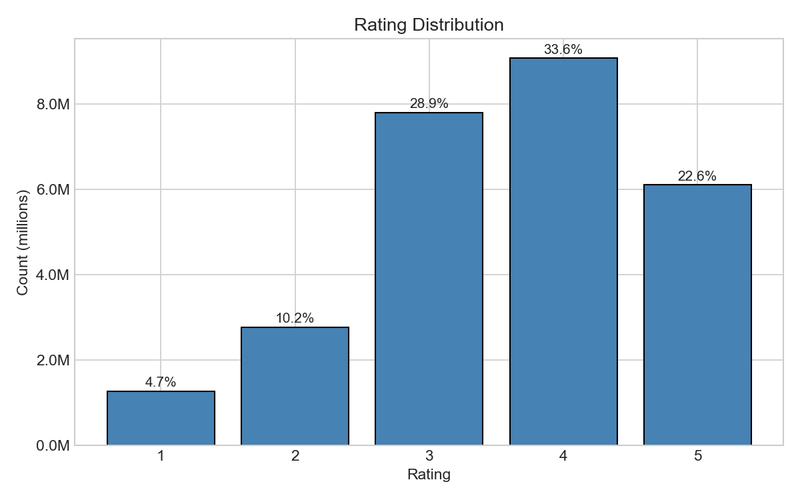
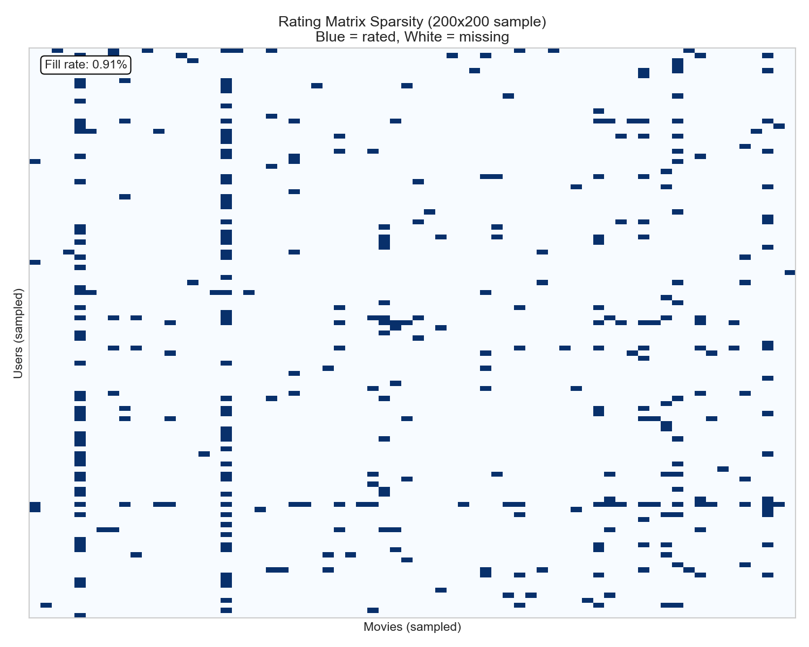
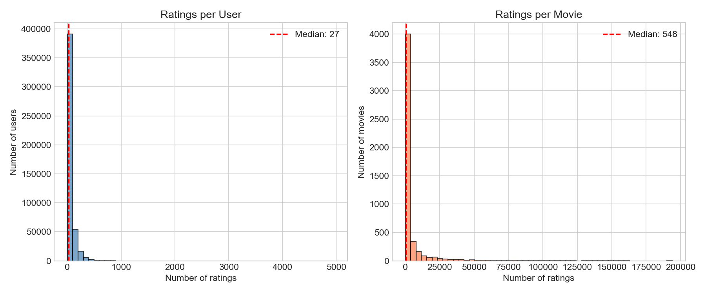
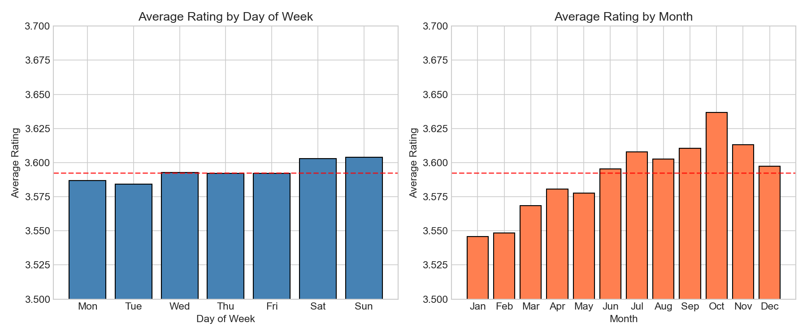
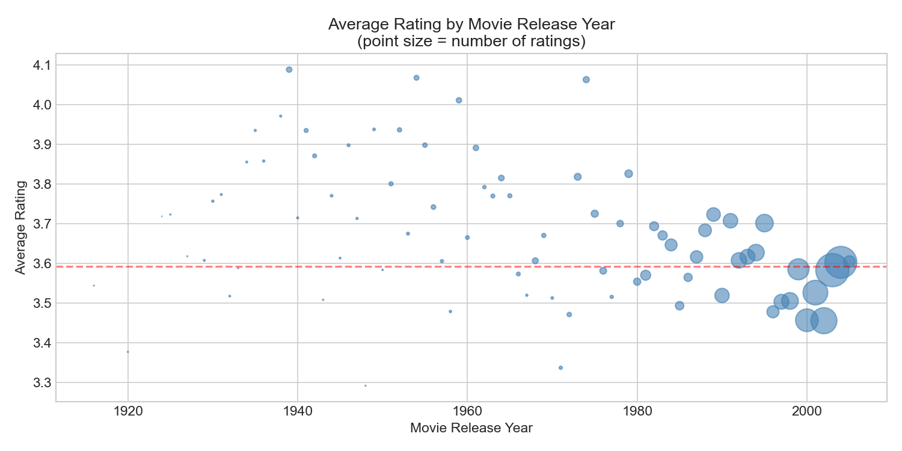

# Exploratory Data Analysis: Netflix Prize Dataset

## Dataset Overview

The dataset contains **27 million ratings** from **472,542 users** across **5,000 movies**, spanning November 1999 to December 2005. The core challenge is immediately apparent: with only **1.14% of the user-movie matrix filled**, we face an extreme sparsity problem with over 2.3 billion missing entries.

## Rating Distribution

Ratings follow a left-skewed distribution centered on 3-4 stars (mean: 3.59, median: 4). The modal rating is 4 stars (33.6%), with relatively few 1-star ratings (4.7%). This non-normal distribution confirms that standard regression assumptions may not hold, and evaluation metrics like RMSE will be influenced by the concentration of ratings in the 3-4 range.

## The Sparsity Problem

A 200×200 random sample of the rating matrix visualizes the challenge: the matrix is overwhelmingly empty (0.91% fill rate in this sample). This sparsity makes traditional regression approaches infeasible—we cannot simply treat missing values as features. Instead, matrix factorization methods that learn latent representations from observed ratings are necessary.

## User and Movie Activity

Both users and movies exhibit heavy-tailed distributions. The median user has rated only 27 movies (min = 1), while the median movie has 548 ratings (min = 13). However, the distributions have long tails—some users have rated nearly 5,000 movies, and one movie has nearly 200,000 ratings. This imbalance means:

- **Cold-start problem**: Many users/movies have minimal data for learning preferences
- **Popular item dominance**: A small subset of movies accounts for disproportionate rating volume
- **Regularization necessity**: Models must avoid overfitting to sparse users/movies

## Temporal Patterns

Seasonal analysis reveals subtle but consistent patterns. Ratings are slightly higher on weekends (Δ = 0.02) and show stronger monthly variation (Δ = 0.09), with October ratings highest and January/February lowest. While these effects are small in absolute terms, they suggest temporal features could marginally improve predictions—though the spec notes this would require modeling a temporal kernel, which is outside our current scope.

## Movie Age Effect

Older movies receive systematically higher ratings than recent releases. Films from the 1930s-1970s average 3.7-4.1 stars, while 2000s releases cluster around 3.5-3.6. This likely reflects **survivorship bias**—only acclaimed classics from earlier eras remain in circulation—combined with possible nostalgia effects. The bubble sizes show that recent movies dominate the rating volume, meaning most predictions will be for contemporary films near the global mean.

## Data Quality

The dataset is clean: no missing values, all ratings within the expected 1-5 range, and perfect alignment between the ratings and movie titles files. This allows us to proceed directly to modeling without imputation or cleaning steps.

## Implications for Modeling

1. **Matrix factorization is essential** — The 98.86% sparsity rules out dense feature-based approaches
2. **Bias terms matter** — User and movie means deviate significantly from the global mean
3. **Regularization is critical** — The long-tailed activity distributions require preventing overfitting to sparse entities
4. **Temporal features are optional** — Effects exist but are small; we will not include them in our baseline or primary model